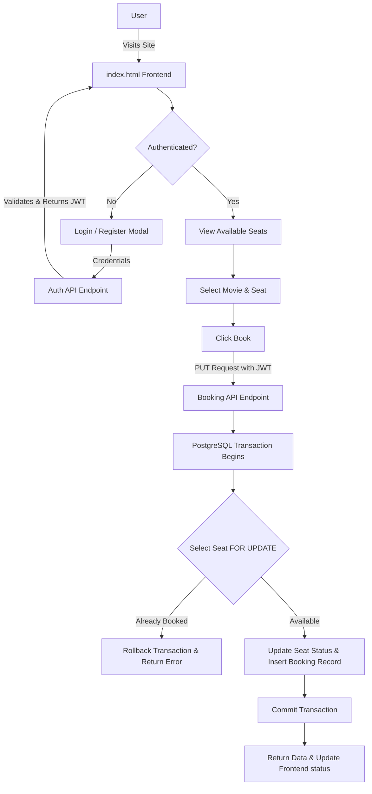
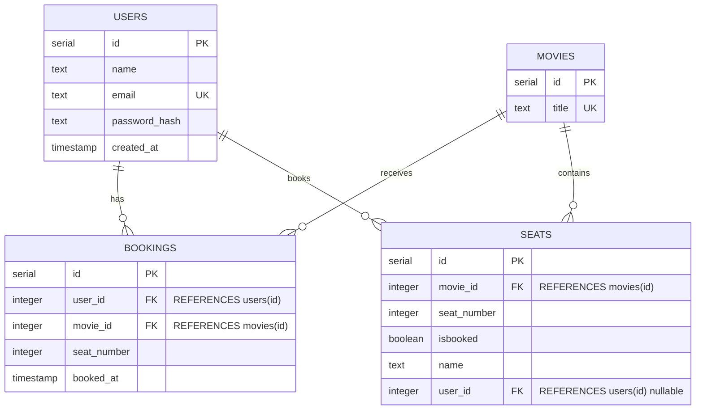

# BookMyShow Clone - Movie Ticket Booking System

A robust, concurrent-safe movie ticket booking system featuring a modern dark-themed frontend and a scalable Node.js backend. This project was originally built for a hackathon and handles real-time seat availability, user authentication, and transaction safety.

## 🌟 Features

- **JWT-Based Authentication:** Secure user registration and login endpoints.
- **Concurrent Seat Booking:** Employs database row-locking (`FOR UPDATE`) with PostgreSQL transactions to prevent double-booking of seats.
- **Automatic Self-Healing/Reset:** When all seats for a movie are booked, the system automatically detects this and resets the seats for continuous testing and flow validation.
- **Booking History Tracking:** Users can view their past booking history (`My Bookings`). The booking history persists even after theater seat resets.
- **Premium User Interface:** A fully responsive, dark-mode inspired UI using Vanilla CSS and JavaScript, complete with custom toast notifications, auth modals, and seat availability indicators.

## 🏗 System Architecture Flowchart



## 🗄️ Database ER Diagram

The database uses PostgreSQL and strictly enforces referential integrity through foreign keys and cascading deletes.



## ⚙️ Tech Stack

- **Frontend:** HTML5, Vanilla CSS3, Vanilla JavaScript (Browser Native)
- **Backend:** Node.js, Express.js
- **Database:** PostgreSQL
- **Security:** `jsonwebtoken` (JWT) for stateless auth, `bcryptjs` for password hashing
- **Validation:** `joi` for DTO validation

## 🚀 Setup & Installation

Follow these steps to run the project locally:

1. **Clone the repository:**
   ```bash
   git clone <repository_url>
   cd BookMyShow
   ```

2. **Install Dependencies:**
   ```bash
   npm install
   ```

3. **Database Setup:**
   Ensure PostgreSQL is installed and running on your machine.
   Create a new database for the application (e.g., `bookmyshow`).

4. **Environment Configuration:**
   Create a `.env` file in the root directory and configure your PostgreSQL connection:
   ```env
   DATABASE=bookmyshow
   DB_USERNAME=postgres
   DB_PASSWORD=your_password_here
   PORT=8080
   JWT_SECRET=your_super_secret_jwt_key
   ```

5. **Start the Server:**
   ```bash
   npm start
   ```
   *Note: Upon starting, the server automatically reads `src/common/init.sql` to initialize all database tables and seed initial movie/seat data.*

6. **Access the App:**
   Open your browser and navigate to `http://localhost:8080`.

## 📁 Project Structure

```text
BookMyShow/
├── .env                        # Environment configuration
├── index.html                  # Main frontend interface
├── index.mjs                   # Express server entry point & core APIs
├── package.json                # Project dependencies
└── src/
    ├── common/
    │   ├── db.js               # DB connection pooling & init logic
    │   ├── init.sql            # Table schemas and seed queries
    │   ├── middlewares/        # Auth and Data Validation middlewares
    │   └── utils/              # Helper utilities (ApiError, ApiResponse)
    └── modules/
        └── auth/               # Auth Component (MVC structural layout)
            ├── auth.controller.js
            ├── auth.routes.js
            ├── auth.service.js
            └── dto/            # Joi validation schemas
```

## 📡 API Reference

### Public Endpoints
- `GET /` - Serves the frontend client (`index.html`).
- `GET /seats?movie_id={id}` - Fetches the current list of seats for the specified movie. Including auto-reset logic if the theater is fully booked.
- `GET /ping` - Health check route.

### Authentication Endpoints
- `POST /api/auth/register` - Registers a new user. Expects `name`, `email`, and `password`.
- `POST /api/auth/login` - Authenticates an existing user and returns a signed JWT.

### Protected Endpoints (Requires `Authorization: Bearer <token>`)
- `PUT /:id/:name` - Books a specific seat (`:id`) with the passenger's name (`:name`) under the logged-in user context.
- `GET /api/my-bookings` - Retrieves the booking history for the authenticated user context.

## 🛡️ Concurrency Concept (How transaction handles duplicate booking)

To handle race conditions (multiple users trying to book the same seat at the exact same millisecond):
1. A Postgres `BEGIN` transaction is started.
2. The endpoint executes `SELECT * FROM seats WHERE id = $1 AND isbooked = false FOR UPDATE`.
3. The `FOR UPDATE` applies a row-level lock so that no other transactions can modify this row until the current transaction completes.
4. If the row is found, it updates the `seats` table and inserts a tracking record into the `bookings` table.
5. `COMMIT` the transaction. If any error occurs or the seat was already booked by a competing query, `ROLLBACK` is called safely.

---
*Developed with a focus on scalability, clean UI, and robust backend practices.*
